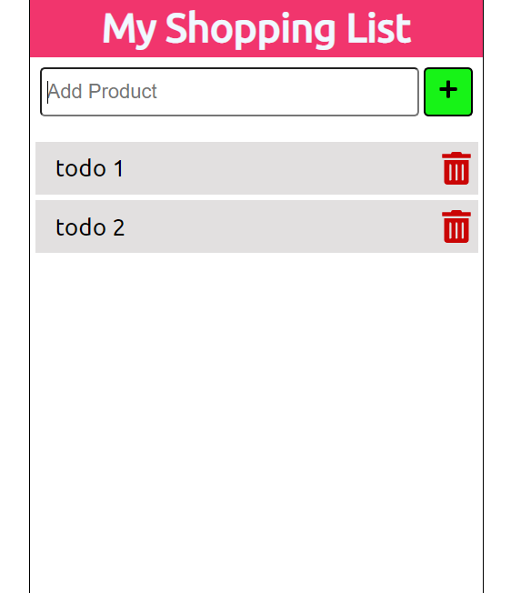

## Simple Shopping List made with React. I save the data in LocalStorage.



To get a local copy of the code, clone it using git:

```
git clone https://github.com/92gahov/Shopping-List
cd Shopping-List
```

Install dependencies:

```
npm install
```

Now, you can start a local web server by running:

```
npm start
```

### `Final result` <a href="https://shopping-list-app.surge.sh/" target="_blank">here</a>